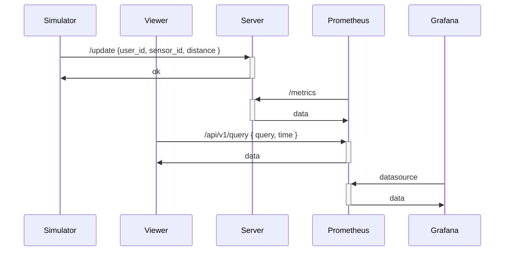

# Triangle localization Simulator

Explore triangulation localization in action with our app. See how it precisely determines the 3D position of a target from sensor distances, and visualize it instantly. We use a TSDB to store data for easy visualization. Experience the simplicity and power of triangulation localization with our app.


## Quick start

### Development Environment Setup

```
// Start the service
docker-compose up -d

// Shut down the service
docker-compose down
```

### Endpoints

- `http://localhost/triangle-localization-simulator/simulator`: Access the 3D webpage to gather sensor data from a synthetic scene.
- `http://localhost/triangle-localization-simulator/viewer`: Retrieve data from Prometheus and visualize the target in 3D.
- `http://localhost/api/`: Prometheus APIs.
- `http://localhost/update`: Node server api for saving current sensor data.
- `http://localhost/metrics`: Endpoints for Prometheus to collect data.
- `http://localhost/:3000`: Grafana for visualizing data in a line chart.

## Dependencies

- [mui](https://mui.com/x/react-charts/lines/): Utilize MUI to create a line chart visualization on the webpage.
- [three](https://threejs.org/): Incorporate Three.js to render a 3D synthetic scene, complete with camera controls, object transformation tools, and mouse-click 3D point detection.
- [three-pathfinding](https://github.com/donmccurdy/three-pathfinding): Utilize Three.js Pathfinding to implement a tool for finding paths from point to point based on a given navigation model.
- [numeric](https://github.com/sloisel/numeric): A library for numerical analysis, used in our case to solve Triangle Localization equations.

## Dataflow



## References

- [Explanation of Triangle Localization](https://4rdp.blogspot.com/2008/05/gps.html)
